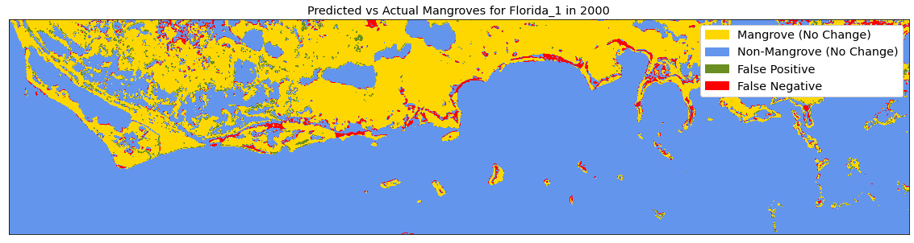

# Mapping Mangrove Growth and Deforestation using Satellite Imagery

This project was developed over three weeks as part of the [Metis](https://www.thisismetis.com/) data science boot-camp in Winter 2021. For details on the overall process beyond what is contained here, please see the [blog post](https://nkinnaird.github.io/posts/2021/03/blog-mapping-mangroves/) I've written on this project.


### Objective:
---

Mangroves are salt-tolerant, tropical trees which live and thrive along warm coastal waters. These mangroves provide a number of benefits including storing 4-10 times more carbon than ordinary land forests (per unit area), protecting shorelines against storm surges, filtering pollutants from ocean waters, and providing habitats for many species. These mangroves are under threat from both climate change and more immediate man-made causes. Because of this, monitoring and tracking these mangroves is a vital task for protecting our environment on a global and a local scale. Satellites are a great tool for remote monitoring of mangroves worldwide. They can provide a constant stream of useful information for hard to reach places. For this project, I developed a neural network classifier to map the extent of mangroves in the south of Florida.


### Methodology and Results:
---


```python
model = keras.Sequential()
model.add(Conv2D(32, kernel_size=3, padding='valid', activation='relu', input_shape=(7, 7, 7)))
model.add(Dropout(0.25))
model.add(Conv2D(48, kernel_size=3, padding='valid', activation='relu'))
model.add(Dropout(0.25))
model.add(Flatten())
model.add(Dense(64, activation='relu'))
model.add(Dropout(0.25))
model.add(Dense(2, activation='softmax'))

model.compile(optimizer= 'adam', loss='sparse_categorical_crossentropy', metrics=['accuracy', 'recall'])
```

<!-- 


 -->

| F1 Scores    | Basic NN    | CNN    |
| :----------- | :-----------: | :-----------: |
| Test Data          | 0.871 | 0.914 |
| Separate Image 1   | 0.911 | 0.921 |
| Separate Image 2   | 0.870 | 0.901 |





### Tools and Techniques:
---

- Python, JavaScript
- NumPy
- Google Earth Engine
- Scikit-learn
- TensorFlow, Keras
- Convolutional Neural Network
- Classification
- Matplotlib
- imageio, rasterio, pyrsgis
- Google Colab, JupyterLab on Google Colab


### File Details:
---

- `code/`

	- `fitWithBasicNN.ipynb` - notebook which fits satellite data with a basic neural network model
	- `fitWithCNN.ipynb` - notebook which fits satellite data with a convolutional neural network model
	- `firstNN.ipynb` - original notebook which fits satellite data with a basic neural network model, with all code and functions contained locally
	- `dataImageUtils.py` - methods and code for processing image data for neural network models
	- `plotEvalUtils.py` - plotting and model evaluation methods
	- `createGifs.ipynb` - notebook for generating gifs from previously saved plots and images
	- `acquire_mangrove_images.js` - script for generating satellite image data on Google Earth Engine for years 2000 and 2020, should be run through the web API
	- `acquire_mangrove_images_loop.js` - script same as above, except this file has a loop for generating images for consecutive years
	- `setupColab.sh` - setup script in order to get JupyterLab up and running on Google Colab, should be run on a Colab instance with high RAM

	- `SavedPlots/` - folder containing many saved plots and images
	- `attic/` - folder containing older/initial coding work

- `SatelliteImages/` - folder containing satellite images, I've only committed images for the Florida_1 location as otherwise the repository would get too large

- `Models/` - folder containing some saved models
