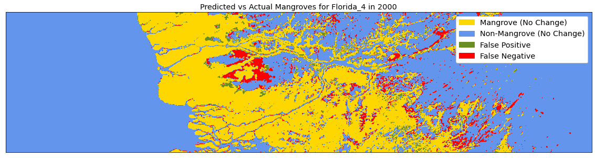
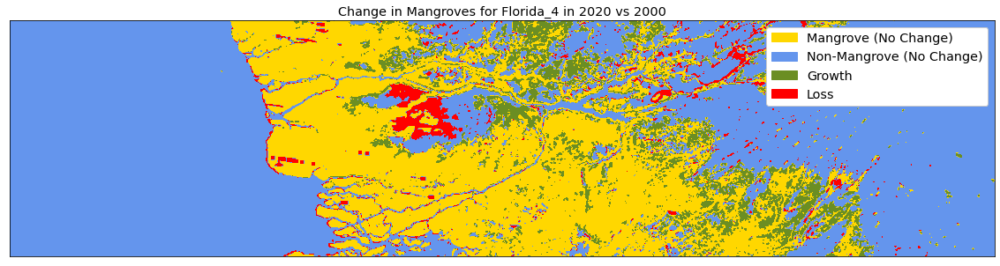

# Mapping Mangrove Growth and Deforestation using Satellite Imagery

This project was developed over three weeks as part of the [Metis](https://www.thisismetis.com/) data science boot-camp in Winter 2021. For details on the overall process beyond what is written about here, please see the [blog post](https://nkinnaird.github.io/posts/2021/03/blog-mapping-mangroves/) I've written on this project.


### Objective:
---

Mangroves are salt-tolerant, tropical trees which live and thrive along warm coastal waters. These mangroves provide a number of benefits including storing 4-10 times more carbon than ordinary land forests (per unit area), protecting shorelines against storm surges, filtering pollutants from ocean waters, and providing habitats for many species. These mangroves are under threat from both climate change and more immediate man-made causes. Because of this, monitoring and tracking these mangroves is a vital task for protecting our environment on a global and a local scale. Satellites are a great tool for remote monitoring of mangroves worldwide. They can provide a constant stream of useful information for hard to reach places. **For this project, I trained a neural network classifier on satellite imagery in order to map the extent of mangroves in the south of Florida.**


### Methodology:
---

First, I acquired freely available satellite imagery through Google Earth Engine of the Florida coastline, as well as a map of mangroves around the world for the year 2000. They have a nice web API that I wrote a JavaScript script for to gather this data in my region of interest. I selected Landsat 7 satellite imagery for the year 2000, (same year as the mangrove map), and the year 2020. The Landsat 7 satellite data has a resolution of 30 meters per pixel, and contains information in 8 different "bands." These bands are the RGB bands, infrared, thermal, and so on. I chose the first 7 as my features, dropping the last one which was of less use to me. **To be specific about my project now, I developed a pixel-wise classification model of said satellite imagery, with target classes of "mangrove" and "not-mangrove," using the band information as my features.**

Before I could immediately start analyzing the data, I first needed to construct composite satellite images. Each individual satellite image can contain clouds, cloud shadows, and artifacts which obscure the land in the image. By compositing images together such that each individual pixel can come from a different image, these clouds and artifacts can be removed. I selected pixels by maximum NDVI value, or "normalized difference vegetation index," which is essentially a measure of the amount of green vegetation within a pixel. Selecting on this value out of all satellite images taken throughout an entire year removed those clouds and also helped me account for the changing of the seasons. The gif below shows an ordinary RGB view of part of the coastline, overlaid with the NDVI view, and then the map of mangroves. The most heavily forested areas correspond to the darkest green colors in the NDVI view, which then correspond to the locations of mangroves.


After I had the data, I then moved on to the modeling. I tested out two different neural networks. One was a basic neural net model with two layers and 14 nodes per layer. The second was a simple convolutional neural network model with a couple of convolutional and dropout layers. The code block below gives the exact architecture used. The input to this CNN model was the band information in a 7x7 pixel grid around the target pixel, as shown in the figure below. The CNN model then used those 7<sup>3</sup> = 343 numbers to predict the class of the central, target pixel.


```python
model = keras.Sequential()
model.add(Conv2D(32, kernel_size=3, padding='valid', activation='relu', input_shape=(7, 7, 7)))
model.add(Dropout(0.25))
model.add(Conv2D(48, kernel_size=3, padding='valid', activation='relu'))
model.add(Dropout(0.25))
model.add(Flatten())
model.add(Dense(64, activation='relu'))
model.add(Dropout(0.25))
model.add(Dense(2, activation='softmax'))

model.compile(optimizer= 'adam', loss='sparse_categorical_crossentropy', metrics=['accuracy', 'recall'])
```


For training data, I passed in pixels from four separate wide-field images of the Florida coastline in the year 2000 to the model. I specifically trained on year 2000 data, because that was the year the map of mangroves was constructed for. I then tested the model both on held-out pixels from the original images, as well as two separate images entirely. Lastly, I applied my model to satellite images for the year 2020, in order to track changes in the last 20 years. 


### Results:
---

The table below gives the F1 scores for the two neural network models for the three sets of test data. You can see that the CNN outperformed the basic neural net anywhere from 1-4% depending on the exact test data used. For the CNN, the F1 score was over 90% in each case. Here I chose F1 as my metric of optimization because I cared about the precision and recall of the positive class equally, and more so than something like accuracy. (Which naturally was high anyways since there was a decent amount of water in each of the satellite images.)


| F1 Scores    | Basic NN    | CNN    |
| :----------- | :-----------: | :-----------: |
| Test Data          | 0.871 | 0.914 |
| Separate Image 1   | 0.911 | 0.921 |
| Separate Image 2   | 0.870 | 0.901 |


The two images below then show the CNN model results for year 2000 data for the two separate images listed in the above table. In the images, gold indicates mangrove areas which were accurately classified by the model, blue as non-mangrove areas which were accurately classified by the model, and then green and red as false positives and false negatives respectively. In general the model performed pretty well, though it wasn't perfect. In some cases, such as for lighter-green colored mangrove forests, the model had trouble accurately predicting the true class.





Lastly, the two images below show the CNN model results for year 2020 data. Here the colors are the same, except now green and red stand for growth and loss respectively. (There will still be some false positives and false negatives in these images, but they should be a fraction of the true change.) In the top image it can be seen that for that particular part of the Florida coastline there is quite a bit of loss in the last 20 years. The bottom image shows that it's not all doom and gloom however, as there are various places of growth further inland.





### Last Words:
---

Overall, I'm pretty happy with the results of this project. If I had more time I could apply the same procedure to other places around the world. (Originally I was doing this for Brazil and in the Caribbean before I decided to better focus my project.) Beyond that, supplementing my data with other information such as elevation would likely increase the precision and recall of my models. And lastly, a more powerful neural network model might succeed where these simple models struggle, such as a pre-trained U-Net model. Again, I invite you to read my [blog post](https://nkinnaird.github.io/posts/2021/03/blog-mapping-mangroves/) on this project which contains more extensive details than I've gone through here, along with various links to external resources.


### Tools and Techniques:
---

- Python, JavaScript
- NumPy
- Google Earth Engine
- Scikit-learn
- TensorFlow, Keras
- Convolutional Neural Network
- Classification
- Matplotlib
- imageio, rasterio, pyrsgis
- Google Colab, JupyterLab on Google Colab


### File Details:
---

- `code/`

	- `fitWithBasicNN.ipynb` - notebook which fits satellite data with a basic neural network model
	- `fitWithCNN.ipynb` - notebook which fits satellite data with a convolutional neural network model
	- `firstNN.ipynb` - original notebook which fits satellite data with a basic neural network model, with all code and functions contained locally
	- `dataImageUtils.py` - methods and code for processing image data for neural network models
	- `plotEvalUtils.py` - plotting and model evaluation methods
	- `createGifs.ipynb` - notebook for generating gifs from previously saved plots and images
	- `acquire_mangrove_images.js` - script for generating satellite image data on Google Earth Engine for years 2000 and 2020, should be run through the web API
	- `acquire_mangrove_images_loop.js` - script same as above, except this file has a loop for generating images for consecutive years
	- `setupColab.sh` - setup script in order to get JupyterLab up and running on Google Colab, should be run on a Colab instance with high RAM

	- `SavedPlots/` - folder containing many saved plots and images
	- `attic/` - folder containing older/initial coding work

- `SatelliteImages/` - folder containing satellite images, I've only committed images for the Florida_1 location as otherwise the repository would get too large

- `Models/` - folder containing some saved models
